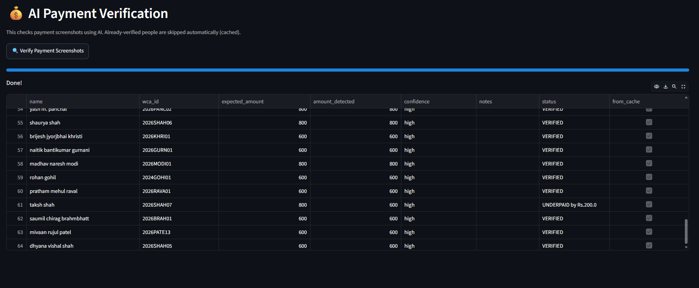
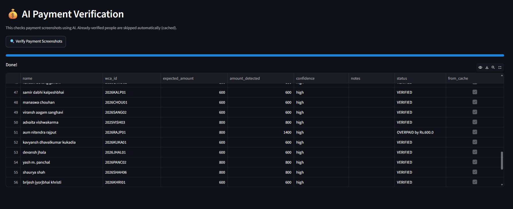

## What is a WCA Competition?

The **World Cube Association (WCA)** is the official governing body for competitive twisty puzzle events such as:

- 3x3x3 Cube
- 2x2x2 Cube
- 4x4x4 Cube
- Pyraminx
- Megaminx
- Skewb
- Clock
- Square-1
- and other official events

To participate in a WCA competition, competitors typically:

1. Register on the official WCA competition page.
2. Fill out a separate organizer registration form.
3. Select the events they wish to compete in.
4. Pay the registration fee.
5. Upload proof of payment.

For small competitions this process can be managed manually, but for larger competitions with 100–500+ competitors, verifying registrations, payments, and event selections becomes time-consuming and error-prone.

---

## Problem Statement

A typical WCA competition may receive registrations from over 100 participants. Organizers must manually verify:

- Whether each competitor registered on both platforms
- Whether event selections match
- Whether the correct registration fee has been paid
- Whether payment proof is valid

Performing these checks manually can take several hours and is susceptible to human error.

The **WCA Registration Auditor** automates these tasks by combining:

- Data reconciliation
- Fuzzy matching
- Google Drive integration
- OCR-based payment verification
- Intelligent caching
- Interactive visualization

into a single workflow.

---

# WCA Registration Auditor

A Streamlit based automation tool for WCA competition organizers that reconciles registrations, verifies event selections, and validates payment screenshots using OCR and intelligent caching.

---

# Features

## 1. Competitor Matching

Matches participants between:

- WCA Registration Export
- Google Form Responses

Matching is performed in three stages:

### Stage 1: WCA ID Matching

Highest confidence matching.

Example:

```text
2025PACH02
```

---

### Stage 2: Email Matching

Used when WCA ID is missing.

---

### Stage 3: Fuzzy Name Matching

Uses RapidFuzz to identify participants with slightly different spellings.

Example:

```text
Vatsal A. Mori
```

matches

```text
Vatsal Ajaysinh Mori
```

---

## 2. Missing Registration Detection

### Missing in WCA

Present in Form but not in WCA export.

### Missing in Form

Present in WCA export but not in Form.

---

## 3. Event Verification

Compares event selections between:

- WCA Website
- Google Form

Reports:

- Missing events
- Extra events
- Event mismatches

---

## 4. Google Drive Screenshot Integration

The payment screenshots uploaded through the Google Form are stored in Google Drive.

The project integrates with the Google Drive API using a Google Service Account to automatically access and download these screenshots.

### Workflow

```text
Google Form
      ↓
Screenshot Upload
      ↓
Google Drive
      ↓
Drive Share Link Stored in Form Response
      ↓
Google Drive API
      ↓
Download Screenshot
      ↓
Local Screenshot Cache
      ↓
OCR Processing
```

### Authentication

The project uses:

- Google Drive API
- Service Account Authentication
- JSON Credentials File

A service account is created in Google Cloud Console and granted access to the folder containing payment screenshots.

This eliminates the need for manual login and allows the system to securely access files programmatically.

---

### File Identification

Each screenshot link submitted through the Google Form contains a unique Google Drive File ID.

Example:

```text
https://drive.google.com/open?id=19HJBy96uE7y2UhP4XymBKIhMouryGc5
```

Extracted File ID:

```text
19HJBy96uE7y2UhP4XymBKIhMouryGc5
```

The application automatically extracts this File ID and uses it to retrieve the corresponding image through the Google Drive API.

---

### Automatic Download

For every participant:

```text
Participant
      ↓
Google Drive Link
      ↓
Extract File ID
      ↓
Google Drive API Request
      ↓
Download Screenshot
      ↓
Store Locally
```

No manual screenshot collection is required.

---

### Screenshot Cache

Downloaded screenshots are stored locally using the Google Drive File ID as the filename.

Example:

```text
data/screenshots_cache/
│
├── 19HJBy96uE7y2UhP4XymBKIhMouryGc5.jpg
├── 1A2B3C4D5E6F7G8H.jpg
└── ...
```

Before downloading a screenshot, the system checks whether it already exists in the cache.

```text
Screenshot Requested
        ↓
Already Downloaded?
      ↙     ↘
    Yes      No
     ↓        ↓
 Use Cache  Download
```

This prevents repeated downloads and significantly reduces API calls.

---

### Benefits

- Fully automated screenshot retrieval
- No manual screenshot management
- Secure access using Service Accounts
- Reduced API usage through caching
- Scalable for large competitions with hundreds of participants

# AI Payment Verification

The payment verification module uses OCR to read payment screenshots and compare the detected amount with the expected competition fee.

---

## OCR Engine

Uses:

- EasyOCR
- OpenCV

No paid APIs are required.

No internet connection is required once screenshots are downloaded.

---

## Intelligent Image Preprocessing

Before OCR runs:

### Step 1

Image is converted to grayscale.

### Step 2

Image is enlarged 2x using cubic interpolation.

This improves readability for:

- UPI screenshots
- PhonePe
- Paytm
- Google Pay

---

## Full Image OCR

Unlike earlier versions that only scanned the top portion of screenshots, the final implementation scans the entire screenshot.

Reason:

Different payment applications display the amount in different locations.

Some screenshots place the amount:

- Near the top
- In the center
- Below confirmation messages

Scanning the entire image improves reliability.

---

## Position Aware Amount Detection

The OCR engine records:

```text
Detected Text
+
Position in Image
+
Confidence Score
```

Example:

```text
₹800
Position = Top 20%
```

This is considered more reliable than:

```text
800
Position = Bottom 90%
```

which is often part of:

- Transaction IDs
- Account Numbers
- Reference Numbers

---

## Smart Amount Extraction

The system is optimized for WCA registration fees.

Expected fee tiers:

| Events | Fee |
|----------|----------|
| 1–3 Events | ₹600 |
| 4–6 Events | ₹800 |

The OCR engine prioritizes finding:

```text
600
800
```

before attempting generic number extraction.

---

## OCR Error Correction

The system automatically fixes common OCR mistakes:

Examples:

```text
8OO → 800
80O → 800
6OO → 600
```

This significantly improves extraction accuracy.

---

## Position Based Verification

### Pass 1

Search for fee amounts in:

```text
Top 50% of image
```

---

### Pass 2

Search in:

```text
Top 70% of image
```

---

### Pass 3

Search entire image.

---

### Pass 4

Fallback generic number detection.

This reduces false positives caused by:

- Transaction IDs
- Timestamps
- Reference numbers

---

## Date and Time Filtering

Before final extraction:

The system removes:

```text
11 Feb 2026
10:27 PM
```

and similar patterns.

This prevents:

```text
10.27
```

being incorrectly interpreted as a payment amount.

---

# Intelligent Caching 

---

## Screenshot Cache

Downloaded screenshots are stored locally.

Location:

```text
data/screenshots_cache/
```

If the same screenshot is processed again:

```text
Google Drive
↓
Already Downloaded?
↓
YES
↓
Reuse Local Copy
```

No re-download occurs.

---

## OCR Result Cache

Verification results are stored in:

```text
data/payment_verification_cache.json
```

Each participant is assigned a unique cache key:

```text
WCA ID
or
Participant Name
```

Example:

```json
{
  "2025PACH02": {
    "amount_detected": 800,
    "status": "VERIFIED"
  }
}
```

---

## Incremental Processing

When the dashboard is run again:

### Previously Verified Participant

```text
Cache Hit
↓
Instant Result
```

No OCR execution.

---

### New Participant

```text
Cache Miss
↓
Download Screenshot
↓
Run OCR
↓
Store Result
```

Only new registrations are processed.

---

## Benefits of Caching

### Faster Processing

Only new screenshots require OCR.

---

### Reduced CPU Usage

EasyOCR is one of the most expensive parts of the pipeline.

Caching eliminates unnecessary OCR execution.

---

### Scalable for Large Competitions

As participant count grows:

```text
Old Method:
Process Every Screenshot

New Method:
Process Only New Screenshots
```

---

# Payment Statuses

Participants are classified as:

## VERIFIED

Detected amount matches expected fee.

---

## UNDERPAID

Detected amount is lower than expected fee.

---

## OVERPAID

Detected amount is greater than expected fee.

---

## MANUAL REVIEW

Triggered when:

- OCR confidence is low
- Amount cannot be detected
- Screenshot cannot be downloaded
- OCR result appears suspicious

---

# Dashboard Features

## Summary Metrics

- Total Competitors
- Missing in WCA
- Missing in Form
- Event Mismatches

---

## Matched Data

Displays successfully matched competitors.

---

## Missing Registrations

Shows:

- Missing in WCA
- Missing in Form

---

## Event Mismatches

Displays discrepancies between selected events.

---

## AI Payment Verification

Runs OCR verification and displays:

- Expected Fee
- Detected Fee
- Status
- Confidence
- Notes

---

# Dashboard Screenshots

## Upload Files


## Home Dashboard


---

## Missing Registrations


---

## Event Mismatches


---

## OCR Scan


---

## Payment Verification

### Could Not Detect


### Underpaid


### Overpaid


---


# Technologies Used

- Python
- Streamlit
- Pandas
- RapidFuzz
- OpenCV
- EasyOCR
- Google Drive API
- OpenPyXL

---


# Where Can This System Be Used?

Although developed for WCA competitions, the system can be adapted for any event that involves:

- Multi-platform registrations
- Fee collection
- Payment screenshot verification
- Participant auditing

Examples include:

- Technical festivals
- Hackathons
- Workshops
- Club events
- Sports tournaments
- Conference registrations

Any event that requires participants to register, pay fees, and upload payment proof can benefit from this system.

# Running the Project

## 1. Clone the Repository

```bash
git clone https://github.com/YashviPachani/WCA-Registration-Auditor.git
cd WCA-Registration-Auditor
```

---

## 2. Create a Virtual Environment

### Windows

```bash
python -m venv venv
venv\Scripts\activate
```

### Linux / macOS

```bash
python3 -m venv venv
source venv/bin/activate
```

---

## 3. Install Dependencies

```bash
pip install -r requirements.txt
```

---

## 4. Configure Google Drive API

1. Create a Google Cloud Project.
2. Enable **Google Drive API**.
3. Create a **Service Account**.
4. Download the credentials JSON file.
5. Rename it to:

```text
credentials.json
```

6. Place it in the project root directory.
7. Share the Google Drive folder containing payment screenshots with the Service Account email (Viewer access).

---

## 5. Launch the Dashboard

```bash
streamlit run dashboard.py
```

Open:

```text
http://localhost:8501
```

if the browser does not open automatically.

---

## 6. Upload Competition Files

Upload:

- WCA Registration Export (`.csv` / `.xlsx`)
- Google Form Responses (`.csv` / `.xlsx`)

through the dashboard.

---

## 7. Verify Payments

Click:

```text
🔍 Verify Payment Screenshots
```

The system will:

- Download new screenshots from Google Drive
- Reuse previously downloaded screenshots
- Run OCR on new screenshots only
- Reuse cached OCR results for previously verified participants
- Generate a payment verification report

---

## 8. Review Results

The dashboard displays:

- Matched Competitors
- Missing in WCA
- Missing in Form
- Event Mismatches
- Payment Verification Results
- Manual Review Cases

---

## Cache Files

Downloaded screenshots:

```text
data/screenshots_cache/
```

OCR verification cache:

```text
data/payment_verification_cache.json
```

Only new participants are processed in subsequent runs, significantly reducing execution time.

# Developed By

Yashvi Pachani & Vatsal Mori
