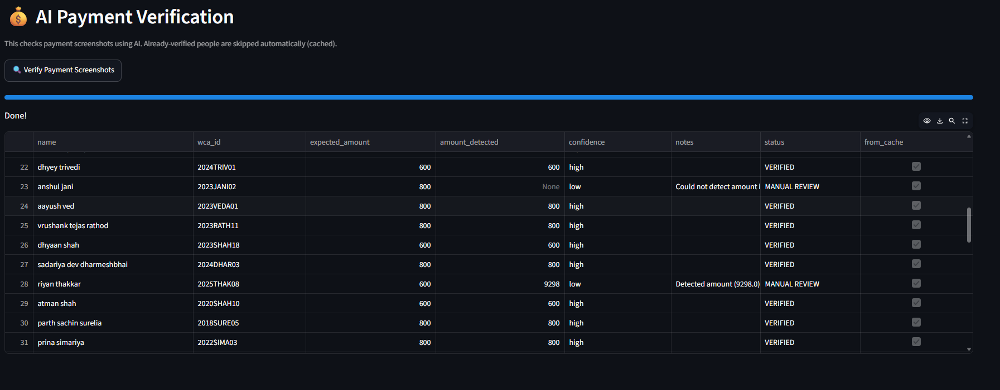

# WCA Registration Auditor

A Streamlit based automation tool for WCA competition organizers that reconciles registrations, verifies event selections, and validates payment screenshots using OCR and intelligent caching.

---

# Problem Statement

Organizing a WCA competition involves verifying information across multiple platforms:

1. WCA Registration System
2. Google Registration Form
3. Payment Screenshots

Manually checking hundreds of registrations is repetitive, time consuming, and prone to human error.

This project automates the entire auditing workflow.

---

# Features

## 1. Competitor Matching

Matches participants between:

- WCA Registration Export
- Google Form Responses

Matching is performed in three stages:

### Stage 1: WCA ID Matching

Highest confidence matching.

Example:

```text
2025PATE01
```

---

### Stage 2: Email Matching

Used when WCA ID is missing.

---

### Stage 3: Fuzzy Name Matching

Uses RapidFuzz to identify participants with slightly different spellings.

Example:

```text
Vatsal A. Mori
```

matches

```text
Vatsal Ajaysinh Mori
```

---

## 2. Missing Registration Detection

### Missing in WCA

Present in Form but not in WCA export.

### Missing in Form

Present in WCA export but not in Form.

---

## 3. Event Verification

Compares event selections between:

- WCA Website
- Google Form

Reports:

- Missing events
- Extra events
- Event mismatches

---

## 4. Google Drive Screenshot Integration

The system automatically reads payment screenshot links submitted through Google Forms.

Supported:

- Google Drive share links
- Google Form file uploads

Screenshots are downloaded automatically.

---

# AI Payment Verification

The payment verification module uses OCR to read payment screenshots and compare the detected amount with the expected competition fee.

---

## OCR Engine

Uses:

- EasyOCR
- OpenCV

No paid APIs are required.

No internet connection is required once screenshots are downloaded.

---

## Intelligent Image Preprocessing

Before OCR runs:

### Step 1

Image is converted to grayscale.

### Step 2

Image is enlarged 2x using cubic interpolation.

This improves readability for:

- UPI screenshots
- PhonePe
- Paytm
- Google Pay

---

## Full Image OCR

Unlike earlier versions that only scanned the top portion of screenshots, the final implementation scans the entire screenshot.

Reason:

Different payment applications display the amount in different locations.

Some screenshots place the amount:

- Near the top
- In the center
- Below confirmation messages

Scanning the entire image improves reliability.

---

## Position Aware Amount Detection

The OCR engine records:

```text
Detected Text
+
Position in Image
+
Confidence Score
```

Example:

```text
₹800
Position = Top 20%
```

This is considered more reliable than:

```text
800
Position = Bottom 90%
```

which is often part of:

- Transaction IDs
- Account Numbers
- Reference Numbers

---

## Smart Amount Extraction

The system is optimized for WCA registration fees.

Expected fee tiers:

| Events | Fee |
|----------|----------|
| 1–3 Events | ₹600 |
| 4–6 Events | ₹800 |

The OCR engine prioritizes finding:

```text
600
800
```

before attempting generic number extraction.

---

## OCR Error Correction

The system automatically fixes common OCR mistakes:

Examples:

```text
8OO → 800
80O → 800
6OO → 600
```

This significantly improves extraction accuracy.

---

## Position Based Verification

### Pass 1

Search for fee amounts in:

```text
Top 50% of image
```

---

### Pass 2

Search in:

```text
Top 70% of image
```

---

### Pass 3

Search entire image.

---

### Pass 4

Fallback generic number detection.

This reduces false positives caused by:

- Transaction IDs
- Timestamps
- Reference numbers

---

## Date and Time Filtering

Before final extraction:

The system removes:

```text
11 Feb 2026
10:27 PM
```

and similar patterns.

This prevents:

```text
10.27
```

being incorrectly interpreted as a payment amount.

---

# Intelligent Caching 

---

## Screenshot Cache

Downloaded screenshots are stored locally.

Location:

```text
data/screenshots_cache/
```

If the same screenshot is processed again:

```text
Google Drive
↓
Already Downloaded?
↓
YES
↓
Reuse Local Copy
```

No re-download occurs.

---

## OCR Result Cache

Verification results are stored in:

```text
data/payment_verification_cache.json
```

Each participant is assigned a unique cache key:

```text
WCA ID
or
Participant Name
```

Example:

```json
{
  "2025PATE01": {
    "amount_detected": 800,
    "status": "VERIFIED"
  }
}
```

---

## Incremental Processing

When the dashboard is run again:

### Previously Verified Participant

```text
Cache Hit
↓
Instant Result
```

No OCR execution.

---

### New Participant

```text
Cache Miss
↓
Download Screenshot
↓
Run OCR
↓
Store Result
```

Only new registrations are processed.

---

## Benefits of Caching

### Faster Processing

Only new screenshots require OCR.

---

### Reduced CPU Usage

EasyOCR is one of the most expensive parts of the pipeline.

Caching eliminates unnecessary OCR execution.

---

### Scalable for Large Competitions

As participant count grows:

```text
Old Method:
Process Every Screenshot

New Method:
Process Only New Screenshots
```

---

# Payment Statuses

Participants are classified as:

## VERIFIED

Detected amount matches expected fee.

---

## UNDERPAID

Detected amount is lower than expected fee.

---

## OVERPAID

Detected amount is greater than expected fee.

---

## MANUAL REVIEW

Triggered when:

- OCR confidence is low
- Amount cannot be detected
- Screenshot cannot be downloaded
- OCR result appears suspicious

---

# Dashboard Features

## Summary Metrics

- Total Competitors
- Missing in WCA
- Missing in Form
- Event Mismatches

---

## Matched Data

Displays successfully matched competitors.

---

## Missing Registrations

Shows:

- Missing in WCA
- Missing in Form

---

## Event Mismatches

Displays discrepancies between selected events.

---

## AI Payment Verification

Runs OCR verification and displays:

- Expected Fee
- Detected Fee
- Status
- Confidence
- Notes

---

# Dashboard Screenshots

## Upload Files


## Home Dashboard


---

## Missing Registrations


---

## Event Mismatches


---

## OCR Scan


---

## Payment Verification

### Could Not Detect


### Underpaid


### Overpaid


---


# Technologies Used

- Python
- Streamlit
- Pandas
- RapidFuzz
- OpenCV
- EasyOCR
- Google Drive API
- OpenPyXL

---


# Developed For

WCA Competition Organizers

# Developed By

Yashvi Pachani & Vatsal Mori